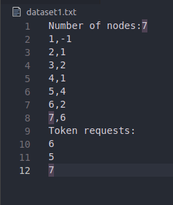

# RaymondsAlgorithm

Author: Facundo Agustin Rodriguez


### Recomendation
I recomend using a .md previewer,
In vscode you can use the integrated previewer with the key combination (Ctrl + Shft + V)

## Dataset
First line must contain "Number of nodes:" immediately followed by a integer value ex."Number of nodes:7".
Starting from the next line we describe our graph
The first value must be the node id, followed by a ',' and the id of the node's parent. ex: \"4:1\
Node id MUST NOT exceed the value of the number of nodes. See example dataset in the documentation."

## Code coments
For a better understanding of the code I recomend start reviewing it starting from the main method inside the Node.java file

## Screenshots of execution

This is how our dataset looks like



We will execute the programm passing the dataset as argument

```bash
javac Node.java
java Node.java dataset1.txt
```

The expected output for this dataset is the following:

```output
Initial state: 
*1 : [2, 4]
 2 : [6]
 3 : []
 4 : [5]
 5 : [5]
 6 : [6, 7]
 7 : [7]


1th. request fulfiled
 1 : [4]
 2 : [1]
 3 : []
 4 : [5]
 5 : [5]
*6 : [7, 2]
 7 : [7]


 1 : [4]
 2 : [1]
 3 : []
 4 : [5]
 5 : [5]
*6 : [7, 2]
 7 : [7]


 1 : [4]
 2 : [1]
 3 : []
 4 : [5]
 5 : [5]
*6 : [7, 2]
 7 : [7]


2th. request fulfiled
 1 : [4]
 2 : [1]
 3 : []
 4 : [5]
 5 : [5]
 6 : [2]
*7 : [6]


 1 : [4]
 2 : [1]
 3 : []
 4 : [5]
 5 : [5]
 6 : [2]
*7 : [6]


3th. request fulfiled
 1 : [2]
 2 : [6]
 3 : []
 4 : [1]
*5 : [4]
 6 : [7]
 7 : []


 1 : [2]
 2 : [6]
 3 : []
 4 : [1]
*5 : [4]
 6 : [7]
 7 : []


 1 : [2]
 2 : [6]
 3 : []
 4 : [1]
*5 : [4]
 6 : [7]
 7 : []


 1 : [2]
 2 : [6]
 3 : []
 4 : [1]
*5 : [4]
 6 : [7]
 7 : []


 1 : [2]
 2 : [6]
 3 : []
 4 : [1]
*5 : [4]
 6 : [7]
 7 : []


 1 : [2]
 2 : [6]
 3 : []
 4 : [1]
*5 : [4]
 6 : [7]
 7 : []


Final topology: 
1 -> 4
2 -> 1
3 -> 2
4 -> 5
5 -> -1
6 -> 2
7 -> 6
Final Queues state: 
 1 : [2]
 2 : [6]
 3 : []
 4 : [1]
*5 : [4]
 6 : [7]
 7 : []
```